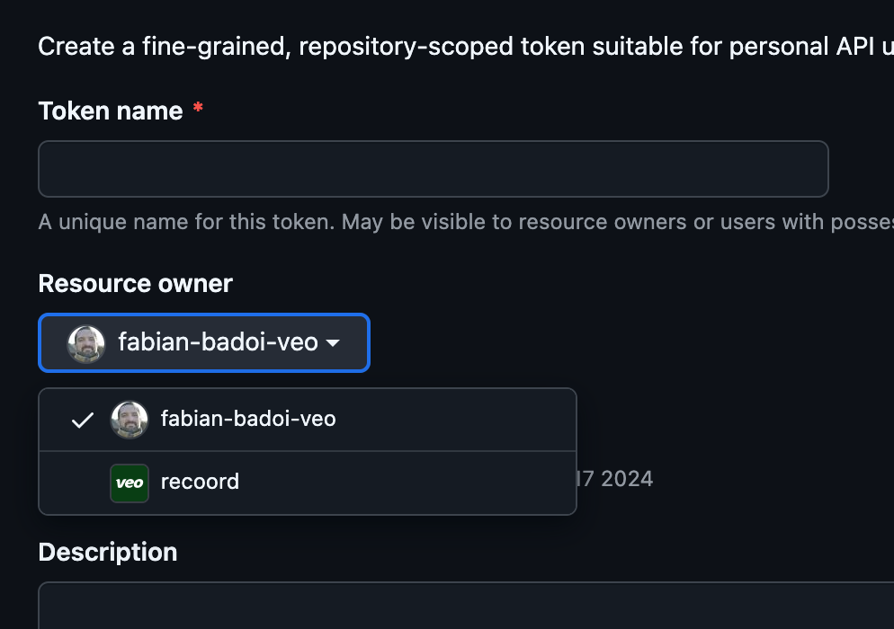

# Heroku buildpack for supporting git+ssh packages hosted on GitHub

This buildpack allows the use of private GitHub repositories as dependencies using the `git+ssh` scheme during the heorku build phase.

This buildpack works by configuring git to internally rewrite `git+ssh` dependencies to `git+https`. This is done to gain
the benefits of using [fine-grained access tokens].

Unlike using deploy keys, multiple repositories are supported.
Unlike using [machine users], which grant full read-write access to all the user's repositories, fine-grained access tokens can configured to satisfy your security profile.

If you only use `git+https` instead of `git+ssh` as dependencies, you should use [the official netrc buildpack] instead.


## Usage

Setup steps:
```bash
# This is sensitive data and should be read in a secure way.
# The heroku config:set commands above get recorded to shell history, which is insecure.
read -s -p "Enter your access token:" GITHUB_VCS_PACKAGES_ACCESS_TOKEN
echo # Move to a new line after user input
heroku config:set --app app_name GITHUB_VCS_PACKAGES_ACCESS_TOKEN="$GITHUB_VCS_PACKAGES_ACCESS_TOKEN"

# Add the buildpack.
# It needs to be set *before* the buildpack that sets up your project.
heroku buildpacks:add -i 1 https://github.com/recoord/heroku-buildpack-github-vcs-packages.git
```

### GITHUB\_VCS\_PACKAGES\_ACCESS\_TOKEN 

Access token or password for authenticating with the git repository over HTTPS.

The following **permissions** are required when using with GitHub:
- **repository contents**: read-only
- **repository metadata**: read-only (implicitly requested by repository contents)


When creating the token, take care to select the intended **resource owner** - it likely needs to be your organization:



Also take care when choosing what kind of **repository access** to grant. You should either chose _"Only select repositories"_ and configure what you need, or _"All repositories"_. There is no use in choosing _"Public Repositories"_, you do not need this buildpack in order to use those. 


You can [create an access token here].


<!-- Links -->
[fine-grained access tokens]: https://docs.github.com/en/authentication/keeping-your-account-and-data-secure/managing-your-personal-access-tokens#fine-grained-personal-access-tokens
[machine users]: https://docs.github.com/en/authentication/connecting-to-github-with-ssh/managing-deploy-keys#machine-users
[Create an access token here]: https://github.com/settings/personal-access-tokens/new
[the official netrc buildpack]: https://github.com/heroku/heroku-buildpack-github-netrc
